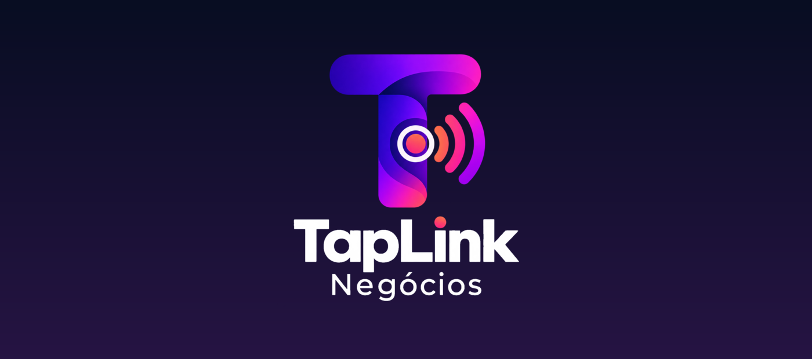
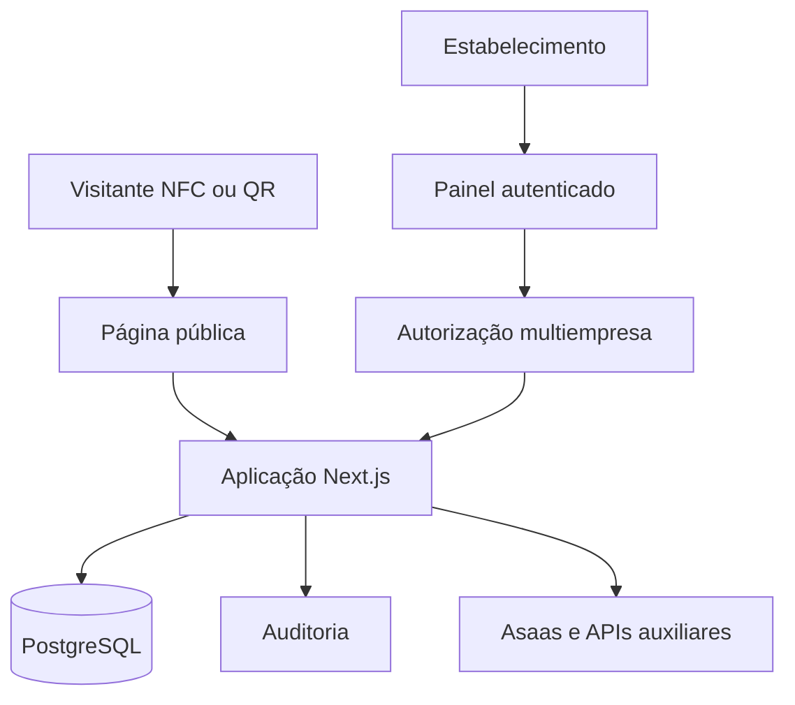

<div align="center">
  

  <br />

  **Tudo do seu negócio em um toque.**

  SaaS multiempresa e white-label integrado a placas NFC e QR Code.

  <br />

  
  
  
  
  
  
  
  

  <br />

  
  
  
  
</div>

---

## Visão do produto

O TapLink Negócios transforma uma placa física com NFC e QR Code em uma página dinâmica do estabelecimento. O cliente aproxima o celular e encontra cardápio, Wi-Fi, WhatsApp, redes sociais, localização, promoções e avaliação no Google.

O estabelecimento altera tudo pelo painel sem reimprimir a placa ou regravar a tag NFC.

### Público inicial

- restaurantes, bares e cafeterias;
- provedores de internet;
- barbearias e salões;
- hotéis e pousadas;
- clínicas, lojas e espaços de atendimento.

## Estado atual

| Marco | Estado | Evidência |
|---|---|---|
| Missão 0 — conceito e protótipo | Concluída | Modelos Lisarojo, GigaNetPe e barbearia |
| Missão 1.1 — fundação | Concluída | Build, PostgreSQL, autenticação e Docker |
| Missão 1.2 — integração real | Concluída | CI com banco real, login e isolamento de tenants |
| Missão 1.3 — editor white-label | Concluída | Rascunho, publicação, Wi-Fi cifrado e página por slug |
| Missão 1.4 — arquivos e gestão | Concluída | Upload, QR Code e painel multiempresa |
| Missão 1.5 — analytics e eventos | Concluída | Eventos anônimos, gráficos, origens e CSV |
| Deploy Debian | Bloqueado | Depende da auditoria somente leitura |

## Funcionalidades implementadas

- autenticação com senha protegida por `scrypt`;
- sessões opacas persistidas pelo hash do token;
- cookie `HttpOnly`, `SameSite=Lax` e `Secure` em produção;
- isolamento entre empresas e funções;
- dashboard autenticado;
- editor white-label responsivo;
- identidade, cores, textos, links e seções;
- atalhos inferiores configuráveis;
- rascunho separado da versão publicada;
- página pública dinâmica `/p/[slug]`;
- Wi-Fi cifrado com AES-256-GCM;
- senha do Wi-Fi ausente do HTML inicial;
- auditoria de salvamento e publicação;
- upload de logo com otimização e remoção de metadados;
- arquivos privados em S3/MinIO e entrega pública por ativo autorizado;
- QR Code Wi-Fi gerado localmente, sem API de terceiros;
- cadastro interno e troca segura de empresa ativa;
- analytics anônimo com visualizações, visitantes, ações e origens;
- deduplicação em janelas de 15 minutos e retenção configurável;
- períodos de 7, 30 e 90 dias e exportação CSV;
- migrations PostgreSQL versionadas;
- CI com banco real e testes ponta a ponta.

## Arquitetura atual



O MVP permanece um monólito modular. Workers, filas e serviços independentes serão extraídos somente quando houver necessidade operacional real. Microsserviço prematuro é só boleto distribuído.

## Estrutura do repositório

```text
taplink-negocios/
├── app/                         # interface e rotas HTTP
│   ├── api/                     # autenticação, editor, saúde e Wi-Fi
│   ├── dashboard/               # painel e editor white-label
│   └── p/[slug]/                # página pública
├── lib/                         # autenticação, criptografia e validações
├── packages/database/           # schema, tenant e migrations
├── tests/                       # testes unitários e de integração
├── public/brand/                # identidade visual oficial
├── docs/                        # produto, servidor e titularidade
├── .github/workflows/           # CI com PostgreSQL
├── Dockerfile
└── docker-compose.homolog.yml
```

## Rotas principais

| Rota | Acesso | Função |
|---|---|---|
| `/` | Público | Apresentação do produto |
| `/login` | Público | Autenticação |
| `/dashboard` | Autenticado | Visão geral da empresa |
| `/dashboard/page-editor` | Autenticado | Editor white-label |
| `/dashboard/organizations` | Autenticado | Seleção da empresa ativa |
| `/dashboard/analytics` | Autenticado | Métricas e gráficos da empresa |
| `/admin/companies` | Administrador da plataforma | Cadastro de empresas |
| `/p/[slug]` | Público | Página publicada |
| `/api/health` | Técnico | Saúde da aplicação e banco |
| `/api/page-settings` | Autenticado | Rascunho e publicação |
| `/api/public/[slug]/wifi` | Público | Wi-Fi publicado sob demanda |
| `/api/public/[slug]/wifi-qr` | Público | QR Wi-Fi gerado localmente |
| `/api/uploads/logo` | Editor autorizado | Upload seguro da logo |
| `/api/public/[slug]/events` | Público | Coleta anônima e deduplicada |
| `/api/analytics/export` | Autenticado | Exportação CSV por período |

## Desenvolvimento local

### Pré-requisitos

- Node.js 24 ou superior;
- Docker e Docker Compose;
- Git.

### Instalação

```bash
git clone https://github.com/nicholasrichardsonsecurity/taplink-negocios.git
cd taplink-negocios
cp .env.example .env
npm ci
docker compose -f docker-compose.homolog.yml up -d postgres
npm run db:migrate
npm run dev
```

Acesse `http://localhost:3000`.

O primeiro proprietário é criado uma única vez por `POST /api/auth/bootstrap`, utilizando `BOOTSTRAP_TOKEN`. Depois da primeira criação, o endpoint recusa novas inicializações.

## Qualidade

```bash
npm run check:ownership
npm run typecheck
npm run test:unit
npm run build
npm audit --omit=dev
```

O GitHub Actions também executa:

- PostgreSQL 17 descartável;
- migrations desde banco vazio;
- bootstrap único;
- login, cookie e dashboard;
- isolamento entre duas empresas;
- editor, publicação e rascunho;
- verificação de que o Wi-Fi não está em texto puro;
- build de produção.

## Infraestrutura de homologação

- servidor Debian próprio;
- IP inicial: `190.89.151.9`;
- diretório previsto: `/opt/taplink/taplink-negocios`;
- Compose: `taplink-homolog`;
- rede, volumes, banco e credenciais exclusivos;
- aplicação ligada inicialmente apenas a `127.0.0.1`;
- PostgreSQL e armazenamento sem portas públicas;
- LoopClub completamente separado.

Nenhum deploy será realizado antes da auditoria definida em [`docs/SERVER_ISOLATION.md`](docs/SERVER_ISOLATION.md).

## APIs e integrações

### MVP

- Asaas — assinatura e cobrança;
- ViaCEP ou BrasilAPI — preenchimento de endereço;
- IBGE Localidades — estados e municípios;
- Google Avaliações — link direto configurado;
- WhatsApp `wa.me` — atendimento e pedidos.

### Futuras

- Google Business Profile;
- WhatsApp Cloud API;
- Instagram Graph API;
- OpenStreetMap;
- Open-Meteo para campanhas contextuais.

NFC, QR Code, Wi-Fi, editor, analytics e páginas não dependerão de API externa para funcionar.

## Agentes e aceleração

O desenvolvimento poderá usar skills locais para revisar escopo, dependências e histórico Git. Recursos comerciais de IA serão opcionais e entrarão depois do analytics convencional.

Consulte o guia de agentes, instalação e roadmap em [`docs/AI_ACCELERATION_AND_AGENTS.md`](docs/AI_ACCELERATION_AND_AGENTS.md).

## Segurança

- dados reais ainda são proibidos;
- `.env`, credenciais e backups nunca são versionados;
- Wi-Fi é cifrado antes da persistência;
- perfil analista não pode publicar;
- banco e armazenamento permanecem internos;
- deploy exige CI, backup, healthcheck e rollback;
- pentest e revisão LGPD são obrigatórios antes de clientes reais.

Consulte [`SECURITY.md`](SECURITY.md).

## Próxima missão

### Missão 1.6 — inteligência opcional

- resumos automáticos baseados nos analytics;
- recomendações de atalhos e campanhas;
- orçamento e limites de IA por empresa;
- fallback integral sem modelo generativo;
- avaliação de qualidade e aprovação humana.

## Titularidade

**Criador e titular:** Nicholas Richardson

**Empresa vinculada:** GigaNetPe Telecom

**Licença:** proprietária e restritiva
**Distribuição:** proibida sem autorização escrita

Este projeto não é open source. O acesso ao repositório não concede autorização de uso, cópia, modificação, hospedagem ou distribuição. Consulte [`LICENSE.md`](LICENSE.md) e [`NOTICE.md`](NOTICE.md).

---

<div align="center">
  

  **Copyright © 2026 Nicholas Richardson · GigaNetPe Telecom**
</div>
